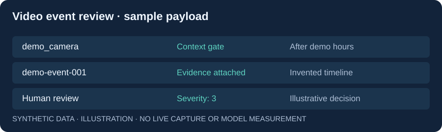

# AI Video Security Pipeline

**An event-driven pipeline that combines video evidence, local multimodal models, and configurable security context.**

Built by **Dor Cohen** during an R&D internship. This independent portfolio snapshot publishes the worker, operator UI, and synthetic lab configuration with a fresh Git history. Camera credentials, certificates/private keys, workplace context, and machine-specific setup files are excluded.


## The problem and the result

Object detection alone does not explain why an event matters. This system consumes closed Frigate events over MQTT, gates candidates using person confidence, working hours and dwell time, retrieves an event clip, and attaches a timeline and camera context to local model analysis. It writes reviewable artifacts and a structured decision, then can annotate the event in Frigate when thresholds are met.

## My contribution

I built the integration worker, event gating, video/evidence handling, inference orchestration, decision processing, and operator configuration interface. **Frigate, Mosquitto, Ollama, and vLLM are upstream services**, not projects I authored.

**Stack:** Python · MQTT · Frigate · FFmpeg · vLLM / Ollama · Docker · Nginx · JavaScript.

## Review the engineering

| Code | Why inspect it |
| --- | --- |
| [Pipeline runner](frigate-ollama-realtime/main.py) | Event deduplication, gating, evidence, and annotation flow |
| [MQTT ingest](frigate-ollama-realtime/mqtt_ingest.py) | Closed-event lifecycle and message handling |
| [Evidence handling](frigate-ollama-realtime/evidence.py) | Clip, frames, and timeline context |
| [Model orchestration](frigate-ollama-realtime/ollama_analyzer.py) | Direct-video analysis, optional frame fallback, and decision parsing |
| [Context administration](frigate-ollama-realtime/context_admin.py) | Operator configuration surface |



This preview uses invented camera and event data. The [sample decision](examples/decision.json) illustrates a payload; it is not a captured event, inference output, or accuracy benchmark.

## Local lab setup

The full pipeline requires an authorized camera or test stream, Frigate, and a compatible local inference endpoint. Direct video analysis needs a video-capable vLLM model and appropriate hardware. Model weights and footage are not included.

```bash
cp .env.example .env
# Configure model names and local inference URLs in .env.
docker compose config --quiet
docker compose up --build -d
```

The demo camera is **disabled** in `config/config.yaml`. Configure your own stream privately, keep its context ID aligned with `contexts/demo_camera.yaml`, and enable it only in your lab. Inside a container, `127.0.0.1` refers to that container; replace the illustrative RTSP URL with a reachable authorized endpoint.

The console is at `http://127.0.0.1:8088`; Frigate's authenticated surface is at `http://127.0.0.1:8971`. The MQTT broker has no published host port. The console/admin API is intended for a local lab and has no application-level access control; do not expose it publicly.

See [setup and integration](docs/SETUP.md) for prerequisites, outputs, and known limits.

## Limits and evidence

- Decisions depend on scene context, model capabilities, and thresholds. **Confidence values are model output, not calibrated probabilities.**
- The repository does not publish a measured detection-accuracy, latency, or false-positive claim.
- GPU/model support and Frigate configuration vary by version. The sample configuration was parsed and rendered; the complete hardware pipeline was not run for this publication.
- The optional frame fallback is explicitly enabled by configuration. Duplicate IDs are bounded in process memory, so a restart can allow reprocessing.
- Prompts and video input can produce incorrect or misleading output. Human review is required for consequential action.

[Architecture and tradeoffs](docs/ARCHITECTURE.md) · [Publication notes](docs/PUBLICATION.md)
